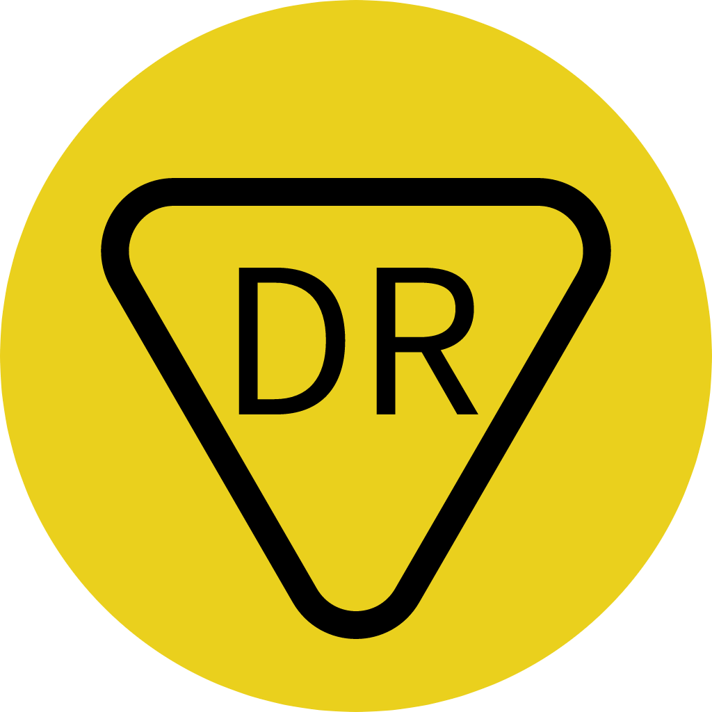

<p align="center"></p>

<h1>Done Redux</h1>

[](https://github.com/GavinHome/done-redux/actions/workflows/build.yml) [](https://codecov.io/gh/gvinhome/done-redux)


## 介绍

Done Redux 是基于Redux思想的组合式状态管理框架，非常适合构建基于.NET7的应用程序，即Donet Redux。

它有四个优势：

> 1. 函数式编程

> 2. 可预测状态容器

> 3. 组件化

> 4. 灵活装配


## 文档

语言: [英文](README.md) | [中文](README.zh.md)


## 使用

-   初始化State，Reducer，Store
-   监听订阅
-   发起修改

```c#
using Redux;

var state = CounterState.initState();
var reducer = CounterReducer.buildReducer();
var store = StoreCreator.createStore<CounterState>(state, reducer);

store.Subscribe(() =>
{
    var lastState = store.GetState();
    var stateJson = System.Text.Json.JsonSerializer.Serialize(lastState);
    Console.WriteLine($"[Subscribe] last-state:{stateJson}");
});

store.Dispatch(CounterActionCreator.add(1));
store.Dispatch(CounterActionCreator.minus(2));

internal class CounterReducer
{
    internal static Reducer<CounterState> buildReducer()
    {
        var map = new Dictionary<Object, Reducer<CounterState>>();
        map.Add(CounterAction.add, _add);
        map.Add(CounterAction.minus, _minus);
        return Converter.asReducers<CounterState>(map);
    }

    private static CounterState _minus(CounterState state, Redux.Action action)
    {
        CounterState? newState = state.Clone(); //clone
        newState.Count -= action.Payload;
        return newState;
    }

    private static CounterState _add(CounterState state, Redux.Action action)
    {
        CounterState? newState = state.Clone(); //clone
        newState.Count += action.Payload;
        return newState;
    }
}

internal enum CounterAction
{
    add,
    minus,
}

internal class CounterActionCreator
{
    internal static Redux.Action add(int payload)
    {
        return new Redux.Action(CounterAction.add, payload);
    }

    internal static Redux.Action minus(int payload)
    {
        return new Redux.Action(CounterAction.minus, payload);
    }
}

[Serializable]
internal class CounterState
{
    public int Count { get; set; } = 0;

    public static CounterState initState()
    {
        var state = new CounterState();
        return state;
    }
}
```


## 例子

- [Counter](test/redux_tests/Counter) - 一个简单的计数器例子.

- [Composite](test/redux_tests/Composite) - 一个组合计数器和消息内容到一个整体状态容器中的例子.

- [Todo List](test/redux_tests/TodoList) - 一个简单的待办例子.

  

## License

[License](LICENSE)

